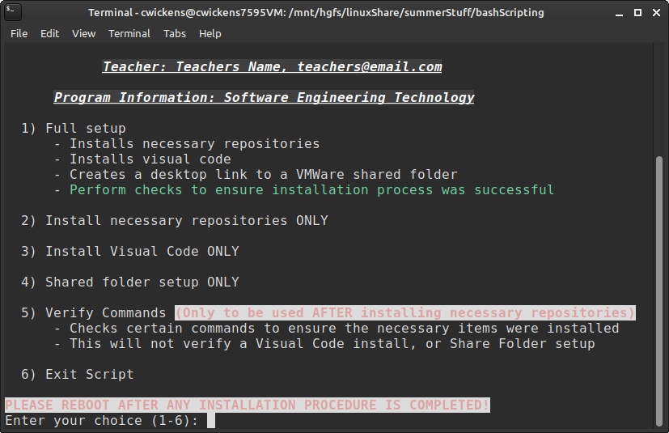

# STM32F303Discovery Tool Installer

I learned to write Bash by writing this script.
My professor for embedded systems gave me some documentation and instructions so I could spend my summer learning about ARM Assembly using the Cortex M4 on the STM32F303Discovery board.

Since I was running Linux Mint using VMWare, I started to poke around inside of the operating system more and more and as a Linux beginner I made a LOT of mistakes.

After my 2nd installation was corrupted, I decided to try and automate the installation of the tools for programming the board.

This eventually led to this completed script! I'm pretty happy with it, I do not have other systems to test this on, but it works fine every time I need to use it.

I made a variable to store a teachers name, in case anyone ever wants to use this for their own purposes.

Feel free to change anything about it, I just did this for fun.

This also provides error logging to trace any problems during the installation process.

# Installation Options
When the script is run, it will allow you to run a full setup or select the setup options to execute:

1) Full setup:
- Execute the following commands:
    - install -y build-essential
    - install -y dfu-util
    - install -y make
    - install -y libtool
    - install -y libftdi-dev
    - install -y libusb-1.0-0-dev
    - install -y minicom
    - install -y gcc-arm-none-eabi
    - install -y gdb-multiarch 
    - install -y vim
    - install -y git
    - install -y openocd
    - install -y modemmanager
    - usermod -a -G dialout $SUDO_USER

- Install Visual Studio Code
    - This requires some extra steps
        - install -y snap
        - apt install -y snapd
        - snap install core
        - snap install code --classic

- Setup Share Folder
    - Requires the share folder being setup in VMWare
    - Adds a symbolic link to the share folder on the desktop
    - Edits /etc/fstab to ensure the share folder is mounted when the guest boots up

- Necessary Checks
    - Ensure creation of symbolic link between:
        - /usr/bin/arm-none-eabi-gdb
        and
        - /usr/bin/gdb-multiarch